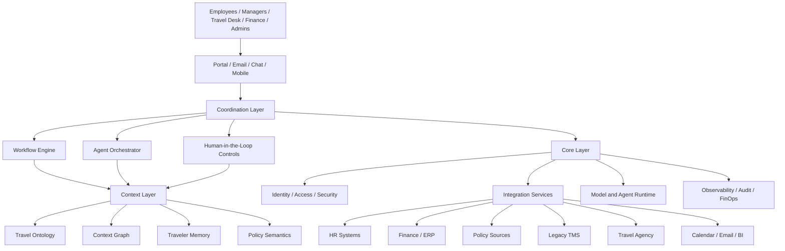

# Master Proposal Submission
## Reimagining Persistent's Travel Management System with AI at the Core

**Proposal Reference:** Response to PSL-TMS-2026-001  
**Client:** Persistent Systems Limited  
**Document Type:** Master Submission Draft  
**Version:** 1.0  
**Date:** April 17, 2026

---

## 1. Executive Summary

Persistent has an opportunity to do more than modernize a travel application. It can establish the first production-grade, AI-native workflow on its 3Cs enterprise architecture and create a repeatable pattern for future workflow transformation.

The current Travel Management System is operationally valuable, deeply embedded, and trusted by users. It works with email approvals, travel agency fulfillment, HR entitlements, finance controls, and reporting processes that have evolved over time. That existing ecosystem should not be treated as a legacy obstacle to be replaced in one motion. It should be treated as a business-critical operating foundation that must be modernized carefully and intelligently.

Our proposal is built on that principle.

We propose a brownfield-ready, AI-first Travel Management System structured around:

- **Core:** secure, governed, observable AI and integration foundation
- **Context:** enterprise travel intelligence through ontology, memory, policy semantics, and connected business context
- **Coordination:** end-to-end orchestration across travelers, approvers, travel desk, finance, agency partners, and AI agents

This approach improves travel request creation, itinerary planning, approval turnaround, agency coordination, expense readiness, reporting, and traveler experience while preserving operational continuity and governance.

Most importantly, this proposal balances ambition with realism. It does not depend on a disruptive big-bang replacement. It introduces AI in bounded, governed ways, builds trust through phased delivery, and creates durable business value beyond the initial travel use case.

---

## 2. Our View of the Business Challenge

Persistent's current TMS was built for a pre-AI operating model. The issue is not simply that some steps are manual. The real challenge is that the current travel lifecycle is spread across disconnected systems, channels, and decision points:

- trip requests begin with incomplete or fragmented inputs
- itinerary selection requires manual effort and back-and-forth
- approvals depend heavily on email patterns and approver availability
- agency coordination is asynchronous and difficult to track end to end
- policy interpretation is not always proactive, contextual, or explainable
- travel, booking, expense, and reporting data are not connected as one lifecycle

At the same time, the current system contains real strengths:

- users are comfortable with current approval behavior
- the travel agency remains a practical fulfillment partner
- HR and finance systems already anchor entitlement and cost discipline
- institutional knowledge exists in the legacy process and surrounding integrations

The right solution must therefore achieve two goals at once:

1. materially improve travel operations and user experience
2. respect the realities of a brownfield enterprise environment

That is the basis of our response.

---

## 3. Proposed Business Solution

We propose a next-generation Travel Management System that transforms travel from a fragmented, manually coordinated process into an intelligent, guided enterprise workflow.

The future-state solution will support:

- conversational and assisted trip request creation
- itinerary recommendations optimized for policy, cost, schedule, and traveler preferences
- dynamic approval routing with policy-aware decision support
- structured coordination with the travel agency
- end-to-end trip lifecycle visibility from request through reimbursement
- traveler support during disruptions and exceptions
- improved reporting, compliance, and operational insight

### 3.1 What Changes for the Business

For employees, travel becomes easier to initiate and easier to track.

For managers, approvals become faster and more informed.

For travel operations, agency interactions become more visible and controlled.

For finance, downstream reimbursement and compliance become more traceable.

For leadership, travel becomes measurable as a connected workflow rather than a set of fragmented activities.

### 3.2 What Stays Grounded

This proposal does not attempt to force abrupt behavior change where it is unnecessary. It preserves continuity where continuity is valuable:

- email approvals remain during transition
- the travel agency remains part of the operating model
- HR, finance, policy, and reporting systems remain authoritative where appropriate
- humans remain accountable for sensitive decisions, exceptions, and ambiguous cases

### 3.3 Business Outcomes

The proposed solution is designed to deliver:

- shorter request and approval cycle times
- reduced manual effort for employees and operations teams
- higher policy compliance at the point of request
- stronger auditability and exception visibility
- improved traveler experience
- a reusable enterprise pattern for future workflow modernization

---

## 4. Solution Architecture: The 3Cs Model

Our solution is explicitly structured around Persistent's 3Cs architecture.

### 4.1 Architecture Overview

### 4.2 Core

The **Core** is the enterprise-grade foundation that governs every intelligent action in the system.

Core capabilities include:

- identity, authentication, and role-based access
- model access and runtime management
- agent execution controls
- observability, tracing, and operational monitoring
- audit logging and compliance controls
- token and infrastructure cost management
- secure integrations with enterprise and partner systems
- secrets management, data protection, and responsible AI guardrails

The Core ensures that AI is not operating outside enterprise controls.

### 4.3 Context

The **Context** layer is what makes the system enterprise-aware and travel-specific.

Context capabilities include:

- travel ontology covering trips, legs, travelers, entitlements, bookings, policies, and exceptions
- context graph connecting employees, projects, trips, approvals, budgets, and history
- traveler memory preserving preferences and historical patterns
- policy semantics that create consistent meaning across workflows and agents
- traceable retrieval from enterprise systems and prior decisions

The Context layer ensures that AI is grounded in real travel, policy, and organizational context.

### 4.4 Coordination

The **Coordination** layer manages the actual work of travel.

Coordination capabilities include:

- trip lifecycle workflow orchestration
- approval routing and escalation
- agent orchestration and task sequencing
- human-in-the-loop review and override
- cross-channel handling across portal, email, chat, and agency interactions
- exception management and status tracking

The Coordination layer ensures that work happens as one connected process rather than disconnected manual steps.

### 4.5 Deterministic Controls

Deterministic controls are applied across the solution so that recommendations and automation remain safe, predictable, and auditable.

These controls include:

- policy validation before submission and before booking
- approval thresholds based on risk, traveler type, cost, and trip category
- confidence thresholds for AI recommendations
- explicit human approval for sensitive or ambiguous cases
- exception workflows for urgent or out-of-policy travel
- full audit trail of user, agent, and system actions
- fallback to manual handling when context is incomplete or confidence is insufficient

This combination of Core, Context, Coordination, and deterministic controls is what makes the solution enterprise-grade rather than simply AI-enabled.

---

## 5. Functional Solution Design

The proposed TMS covers the full travel lifecycle.

### 5.1 Travel Request

Employees can raise travel through portal, chat, or assisted intake. The system captures intent, pre-fills traveler and project context, validates mandatory fields, and prepares a structured request with less manual effort.

### 5.2 Itinerary Planning

The system recommends itinerary options based on travel purpose, policy constraints, budget, schedule, traveler preferences, and historical patterns. It highlights compliant options and explains trade-offs where a preferred choice is not policy-aligned.

### 5.3 Approvals

Approval routing is dynamically driven by org hierarchy, trip type, cost center, entitlement, and policy conditions. Approvers receive context-rich decision support, and low-risk in-policy scenarios can be configured for controlled auto-approval where the business allows it.

### 5.4 Booking Coordination

Once approved, the trip flows into structured coordination with the travel agency. Booking requests, confirmations, modifications, delays, and escalations are tracked through the workflow rather than disappearing into disconnected email chains.

### 5.5 Expense Support

The system extends beyond booking to expense readiness. It supports receipt reminders, missing-document prompts, finance linkage, and anomaly detection so the trip lifecycle does not end when travel concludes.

### 5.6 Risk Alerts and Traveler Support

The platform can surface destination risks, travel advisories, disruption alerts, and emergency handling support. Traveler support becomes a coordinated service path rather than an ad hoc exception process.

### 5.7 Reporting and Insights

The solution provides connected operational, compliance, and financial insight across request volumes, approval times, booking statuses, exception trends, spend patterns, and process bottlenecks.

The functional design is strong because it treats travel as a single managed lifecycle instead of a sequence of independent handoffs.

---

## 6. Data and AI Design

The intelligence backbone of the solution combines structured travel knowledge, enterprise context, and governed agent behavior.

### 6.1 Travel Ontology

The ontology defines the business entities that matter to travel decisioning and execution, including:

- employee
- traveler profile
- manager and approver
- trip and trip leg
- itinerary option and booking
- vendor and travel agency case
- project and cost center
- policy, entitlement, and exception
- advance, expense claim, and reimbursement
- risk advisory

### 6.2 Context Graph

The context graph connects HR, finance, policy, legacy TMS, booking, calendar, approval, and exception data into a usable decision model. This allows the platform to reason consistently about who the traveler is, why the trip is happening, what the policy says, who should approve it, and how the trip should be executed.

### 6.3 Traveler Memory

Traveler memory improves continuity and usability by retaining bounded, privacy-aware historical patterns such as:

- common destinations
- preferred carriers or hotels
- known exception patterns
- prior approval outcomes
- travel document indicators

### 6.4 Agent Model

The AI design uses bounded, role-specific agents rather than one general-purpose assistant. Recommended agents include:

- travel request assistant
- itinerary planning agent
- policy compliance agent
- approval routing agent
- agency coordination agent
- traveler support agent
- expense readiness agent
- reporting and anomaly insights agent

### 6.5 Orchestration Model

Agents operate within workflow-controlled orchestration. Tasks are sequenced by process stage, enriched with enterprise context, and escalated to humans when confidence is low or business sensitivity is high.

### 6.6 Governance and Security

The data and AI design includes:

- model access controls
- prompt and workflow versioning
- auditability of recommendations and actions
- source traceability for critical decisions
- role-based access and secure handling of PII
- encryption, secrets management, and environment separation
- evaluation and review gates before expanding autonomous behavior

This design ensures that AI is useful because it is grounded, and safe because it is governed.

---

## 7. Brownfield Transition Strategy

This is a brownfield modernization, not a greenfield replacement.

Our transition strategy is designed to preserve continuity while progressively shifting business value into the new platform.

### 7.1 What Must Coexist

The future-state solution must coexist with:

- the current legacy TMS
- email-based approval behavior
- the external travel agency operating model
- HR and employee master systems
- finance and ERP systems
- policy repositories
- existing reporting and audit obligations

### 7.2 Coexistence Approach

The legacy TMS remains active during early phases as a reference source, fallback mechanism, and bridge for phased migration.

Email approvals continue during transition, but the new platform enriches them with policy and trip context and captures the outcome in structured workflow state.

The travel agency remains part of the operating model, but the new platform improves visibility through structured request handoff, booking status tracking, and controlled escalation.

HR, finance, and policy systems remain authoritative where they already own the truth.

### 7.3 Migration Approach

We recommend migration by functional slice rather than full-system replacement. This reduces risk and allows the business to validate outcomes incrementally.

Recommended migration sequence:

1. request and traveler context
2. policy evaluation and approval routing
3. agency coordination and booking status
4. expense follow-through
5. historical enrichment and deeper analytics

### 7.4 Parallel Run

Parallel run is essential for building trust. Selected business units or travel scenarios should run through both the new orchestration model and the legacy fallback path until quality, compliance, and operational readiness targets are met.

### 7.5 Cutover Principles

- cut over low-risk and high-volume scenarios first
- keep fallback options active for exceptions
- require sign-off from travel, finance, HR, and compliance stakeholders
- retire legacy capabilities only when replacements are proven stable

This transition strategy is strong because it improves the business early without betting operational continuity on a single cutover moment.

---

## 8. Phased Delivery Roadmap

We recommend a phased roadmap that balances speed, quality, and organizational readiness.

### 8.1 Phase Summary

| Phase | Duration | Focus |
|---|---|---|
| Phase 0 | 2 weeks | Mobilization and planning |
| Phase 1 | 4-6 weeks | Discovery and blueprint |
| Phase 2 | 8-10 weeks | Core foundation and assisted request flows |
| Phase 3 | 8-12 weeks | Approval and agency coordination pilot |
| Phase 4 | 10-14 weeks | Parallel run and phased rollout |
| Phase 5 | 4-6 weeks | Stabilization and optimization |

### 8.2 Phase Details

**Phase 0: Mobilization**
Set governance, confirm scope, establish working model, and secure environment readiness.

**Phase 1: Discovery and Blueprint**
Map current-state dependencies, define future-state process and architecture, clarify policy semantics, and establish success metrics.

**Phase 2: Core Foundation and Assisted Flows**
Implement identity, integration baseline, observability, request intake, and policy support capabilities.

**Phase 3: Approval and Agency Coordination Pilot**
Introduce workflow orchestration, approval routing, exception handling, and agency coordination for pilot scope.

**Phase 4: Parallel Run and Rollout**
Run legacy and new workflows in parallel, tune controls, expand user coverage, and cut over selected process slices.

**Phase 5: Stabilization and Optimization**
Provide hypercare, monitor KPIs, optimize workflows and agents, and prepare the next-wave roadmap.

### 8.3 Testing, Support, and Change Management

The roadmap includes:

- unit, integration, workflow, and user acceptance testing
- policy and approval rule validation
- data reconciliation and audit traceability checks
- hypercare during pilot and early rollout
- targeted training for employees, managers, travel desk, and finance users
- communication that clearly distinguishes what changes and what remains familiar

This roadmap reduces risk while building confidence in the new operating model.

---

## 9. Commercial Proposal

Our recommended commercial structure matches the realities of a brownfield transformation.

### 9.1 Commercial Structure

- fixed-price mobilization and discovery
- milestone-based implementation across major phases
- hypercare followed by managed support

This gives Persistent predictability where scope can be defined early and flexibility where brownfield complexity will only become fully visible through discovery.

### 9.2 Indicative Effort

| Workstream | Indicative Effort |
|---|---:|
| Discovery and blueprint | 6-8 person-weeks |
| Architecture and security design | 4-6 person-weeks |
| UX and workflow design | 4-6 person-weeks |
| Integration engineering | 12-18 person-weeks |
| Workflow and application build | 12-16 person-weeks |
| Data, ontology, and context implementation | 8-12 person-weeks |
| AI and orchestration implementation | 8-12 person-weeks |
| Testing and QA | 6-8 person-weeks |
| Change management and training | 4-6 person-weeks |
| Hypercare and stabilization | 4-6 person-weeks |

### 9.3 Indicative Timeline

The overall program is expected to span approximately **36 to 50 weeks**, depending on integration complexity, data readiness, policy normalization, and rollout scope.

### 9.4 Staffing Model

Recommended core team:

- program manager
- business/process lead
- enterprise architect
- AI or agent architect
- data architect
- security/governance lead
- workflow and application engineers
- integration engineers
- data or AI engineers
- QA lead and testers
- UX lead
- change management lead

### 9.5 Cost Categories

One-time costs:

- architecture and design
- integration build
- workflow and UI development
- data and context implementation
- AI agent implementation
- testing, rollout, and training

Recurring costs:

- hosting or cloud infrastructure
- model consumption
- orchestration or workflow platform licenses
- monitoring and observability tooling
- support and managed operations

### 9.6 Commercial Positioning

The strongest commercial response is not the cheapest-looking one. It is the most transparent one. We recommend clear separation of implementation cost, recurring cost, assumptions, exclusions, and optional future expansions so Persistent can make an informed decision with confidence.

---

## 10. Risks and Mitigation

A proposal is only credible if it acknowledges where execution can fail and shows how risk will be managed.

### 10.1 Key Risks

- undocumented legacy dependencies
- inconsistent policy interpretation across teams or systems
- fragmented or low-quality source data
- pressure to automate before controls are proven
- change resistance from users accustomed to current workflows
- variability in agency interaction patterns
- unclear ownership of business rules and exception handling

### 10.2 Mitigation Strategy

- begin with structured dependency and process mapping
- define policy semantics explicitly during blueprinting
- validate source data quality before using it for AI-supported decisions
- phase automation gradually and keep human review in place
- preserve familiar channels during transition
- establish joint governance across business, technology, finance, and compliance stakeholders
- use parallel run to validate quality before broader rollout

Our risk posture is pragmatic: govern early, validate often, automate responsibly.

---

## 11. Team and Delivery Model

This program requires a cross-functional team rather than a narrow implementation squad.

### 11.1 Recommended Core Roles

- executive sponsor
- program manager
- business process lead
- enterprise architect
- AI or agent architect
- data architect
- integration lead
- security and governance lead
- UX lead
- engineering team
- QA and testing lead
- change management lead

### 11.2 Delivery Model

The delivery model should be collaborative and integrated. Business workflow design, policy interpretation, integration design, and agent behavior cannot be treated as isolated tracks. The strongest execution model brings them together continuously through design reviews, working demos, and acceptance checkpoints.

---

## 12. Demo Use Cases

We recommend that the proposal be supported by 4 to 5 connected demos that tell one lifecycle story.

### Demo 1: Conversational Trip Request Creation

Show an employee initiating a trip through natural language or guided input, with pre-filled traveler, project, and policy context.

### Demo 2: Intelligent Itinerary Recommendation with Policy Explanation

Show ranked itinerary options, policy-compliant recommendations, and explanation of why a preferred option may be out of policy.

### Demo 3: Smart Approval Routing and Low-Risk Auto-Approval

Show dynamic approver selection, contextual approval support, and controlled automation for a routine in-policy scenario.

### Demo 4: Agency Coordination and Booking Status Tracking

Show structured handoff to the agency, booking progress visibility, and handling of booking exceptions or delays.

### Demo 5: Post-Trip Expense Readiness and Anomaly Detection

Show finance follow-through through receipt reminders, reimbursement readiness, and anomaly flagging.

These demos work because they prove value across the full lifecycle rather than showcasing isolated features.

---

## 13. Finalist Presentation Summary

The finalist presentation should reinforce three messages.

### Slide 1: Business Value Proposition

Travel moves from manual coordination to an intelligent, policy-aware, AI-enabled workflow that reduces friction, improves compliance, and creates lifecycle visibility.

### Slide 2: Solution Differentiation

This approach is different because it is:

- explicitly aligned to Persistent's 3Cs
- grounded in a real travel context model
- built with governed multi-agent orchestration
- brownfield-ready rather than greenfield-dependent

### Slide 3: Critical Takeaway

This is not just a better travel system. It is the first AI-native workflow on a reusable enterprise transformation pattern.

### Presentation Timing

- 3 minutes: proposal summary
- 7-8 minutes: connected demo story
- 4-5 minutes: Q&A

### Q&A Themes to Prepare For

- brownfield readiness
- governance and responsible AI
- integration complexity
- commercial realism
- what is automated versus what remains human-controlled

---

## 14. Why This Proposal Wins

This proposal is strong because it does five things well at the same time:

1. It treats travel as a business-critical workflow, not just a UI modernization problem.
2. It uses the 3Cs as a real implementation architecture, not a framing device.
3. It grounds AI in enterprise context and deterministic controls.
4. It respects the reality of brownfield transformation.
5. It creates value beyond travel by establishing a reusable enterprise pattern.

Many responses will describe modern features. Fewer will show how to introduce them safely into the current operating model. That is where this proposal differentiates itself.

---

## 15. Conclusion

Persistent does not need to choose between operational continuity and meaningful innovation. With the right architecture and transition strategy, it can achieve both.

Our proposal reimagines the Travel Management System as an AI-first, governed, context-aware workflow platform that improves the user experience, increases control and visibility, and lays the foundation for broader enterprise workflow modernization.

Travel becomes the first proof point. The platform becomes the long-term asset.
