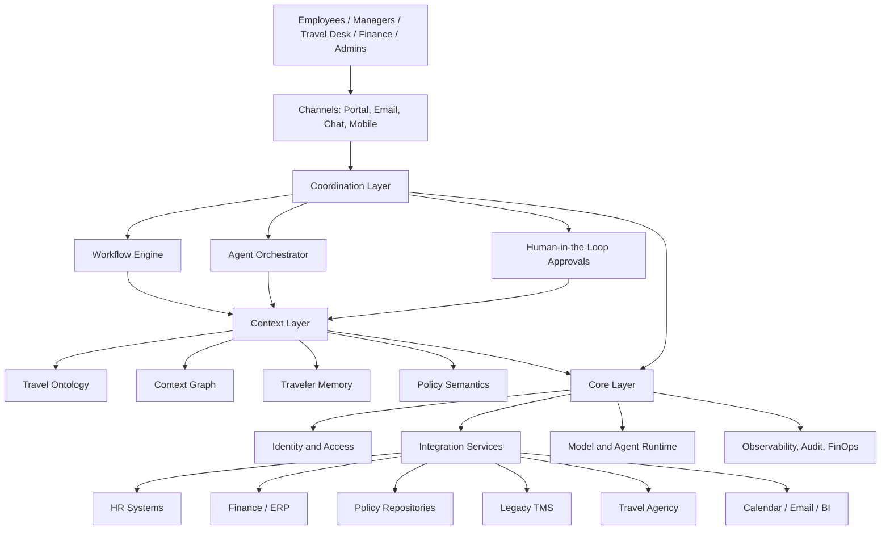

# 3Cs-Based Architecture for AI-First Travel Management System

## 1. Architecture Overview

The proposed Travel Management System is designed as an enterprise workflow platform structured around the **3Cs**:

- **Core:** secure AI and integration foundation
- **Context:** enterprise travel intelligence and memory
- **Coordination:** orchestration across users, agents, systems, and partners

The design separates foundational controls, business intelligence, and operational execution so that AI can act effectively without compromising policy, traceability, or enterprise governance.

## 2. Logical Architecture

## 3. Core Mapping

The **Core** provides the enterprise-grade foundation required to run AI-enabled travel workflows safely and at scale.

### Core Components

- identity and access management
- user, role, and policy enforcement
- integration connectors and API services
- model access layer and runtime management
- agent runtime and execution controls
- observability, logging, and tracing
- audit trails and compliance controls
- token usage and infrastructure cost management
- secrets management and data protection controls

### Core Responsibilities

- authenticate all human and agent actions
- connect enterprise and partner systems
- govern AI model usage and execution boundaries
- provide auditability of actions, recommendations, and approvals
- ensure reliability, monitoring, and supportability
- enforce enterprise security, privacy, and responsible AI policies

## 4. Context Mapping

The **Context** layer grounds the system in travel-specific business reality so recommendations and automation are accurate and explainable.

### Context Components

- travel ontology
- context graph
- traveler memory
- policy semantics
- trip history and decision history
- exception knowledge base
- retrieval layer for enterprise context

### Context Responsibilities

- resolve traveler identity, entitlements, and history
- connect employees, trips, approvals, projects, policies, and bookings
- preserve travel preferences and historical patterns
- provide shared meaning for policy interpretation and exception handling
- supply grounded context to agents and workflows

## 5. Coordination Mapping

The **Coordination** layer is where business work is executed across people, systems, and agents.

### Coordination Components

- travel workflow engine
- approval routing engine
- agent orchestrator
- task queue and state management
- exception and escalation workflows
- human-in-the-loop approval mechanisms
- multi-channel interaction layer

### Coordination Responsibilities

- guide the trip lifecycle from request to reimbursement
- route work to the correct user, agent, or system
- manage approvals and escalations
- coordinate with the travel agency and internal teams
- ensure continuity across request, booking, trip changes, and expense closure

## 6. Deterministic Controls

Deterministic controls ensure that AI-supported actions remain predictable, compliant, and auditable.

### Control Points

- policy validation before request submission
- policy validation before booking confirmation
- approval gates based on cost, traveler grade, trip type, and risk
- confidence thresholds for recommendations and automated actions
- exception workflows for emergency or out-of-policy travel
- explicit human approval for sensitive or ambiguous cases
- audit logs for all agent, system, and user actions
- fallback to manual workflows on low confidence, missing context, or integration failure

### Deterministic Glue Across the 3Cs

- **Core:** identity, logging, audit, security, and runtime controls
- **Context:** traceable business semantics, rule resolution, and source-backed retrieval
- **Coordination:** approval workflows, exception routing, SLA checks, and fallback paths

## 7. Component-to-3Cs Matrix

| Component | Core | Context | Coordination | Deterministic Control |
|---|---|---|---|---|
| Identity and access | Yes | No | No | Access policies, role checks |
| Integration services | Yes | No | Yes | Interface validation, retry rules |
| Model and agent runtime | Yes | No | Yes | Runtime guardrails, execution policy |
| Travel ontology | No | Yes | No | Policy interpretation consistency |
| Context graph | No | Yes | No | Source traceability, lineage |
| Traveler memory | No | Yes | No | Recall boundaries, privacy controls |
| Workflow engine | No | No | Yes | Business rules, approvals, SLAs |
| Approval routing | No | Yes | Yes | Approval thresholds, escalation rules |
| Agency coordination | Yes | Yes | Yes | Status checks, manual fallback |
| Expense support | Yes | Yes | Yes | Finance validations, document checks |
| Reporting and insights | Yes | Yes | Yes | Audit traceability, KPI definitions |

## 8. Why This Architecture Works

This architecture is strong because it prevents the common failure mode of AI-enabled enterprise systems: intelligent-looking recommendations without dependable controls or business grounding.

The proposed model ensures:

- AI is governed by Core, not operating outside enterprise controls
- AI is grounded by Context, not guessing from incomplete inputs
- work is executed through Coordination, not fragmented across disconnected channels
- business-critical decisions remain bounded by deterministic controls

This creates a TMS that is intelligent, reliable, and scalable enough to become the first workflow on a broader enterprise AI platform.
